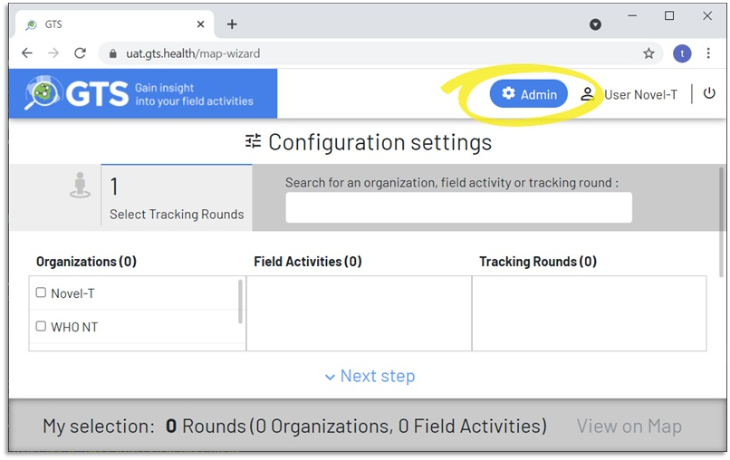
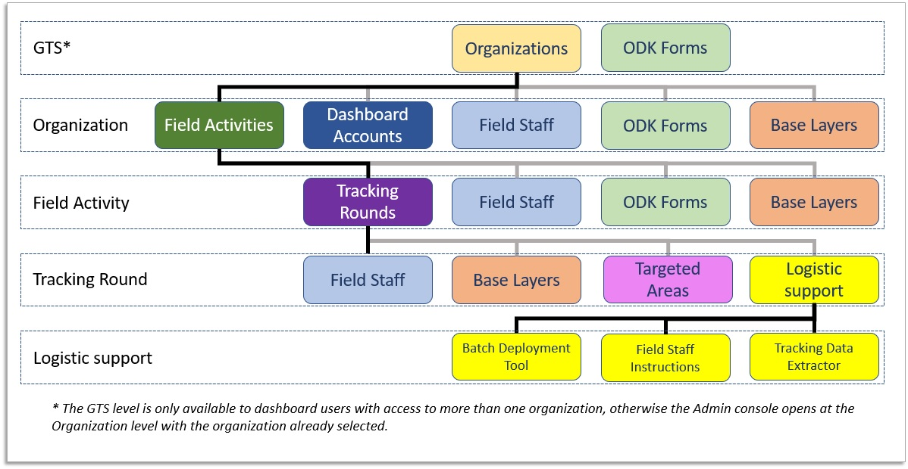
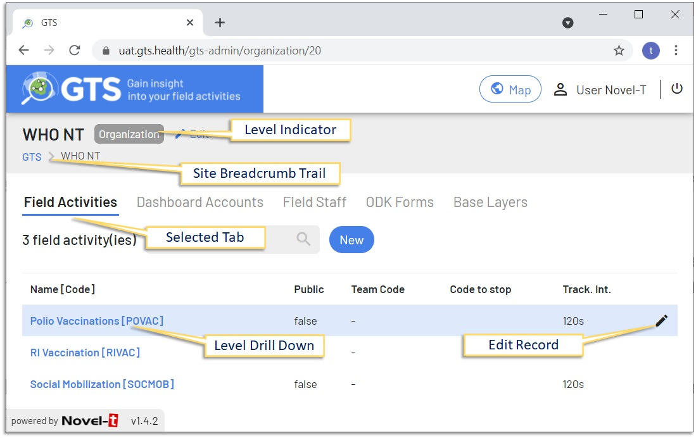

###############################
Accessing The GTS Admin Console
###############################
By default the GTS opens on the Map Wizard page when you login. To access the GTS Administration Console, 
click on the "Admin" button that appears in the GTS banner within the dashboard. *If the button in the
banner is labelled "Map" you are already in the Administration Console*

    GTS Dashboard Admin access

-------------------------------

There are five levels within the GTS Admin console (GTS, Organization, Field Activity, Tracking Round and Logistic Support) 

    GTS Dashboard Admin site navigation

-------------------------------

To drill down to a lower level, click on the name of the feature (Organization, Field Activity, Tracking Round and Logistic Support)
and use the breadcrumb trail to drill back to higher levels.  Each level has a series of tabs, click on the tab heading to select
the tab and navigate to its features. When a feature is highlighted, a pencil icon appears to the right, click on this icon to edit
feature details.

    Admin console Organization level controls

-------------------------------

To access the admin console, you must have a dashboard account, the features available in the console vary 
according to the role assigned to the account.