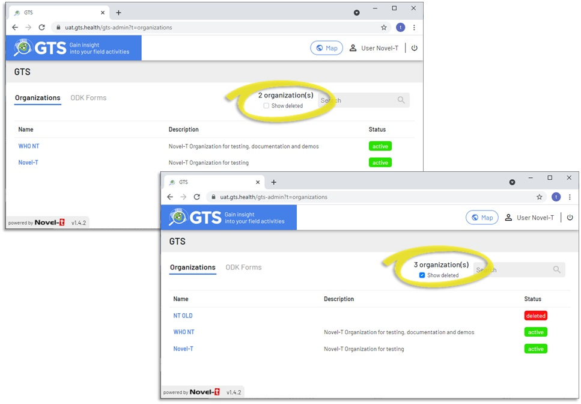
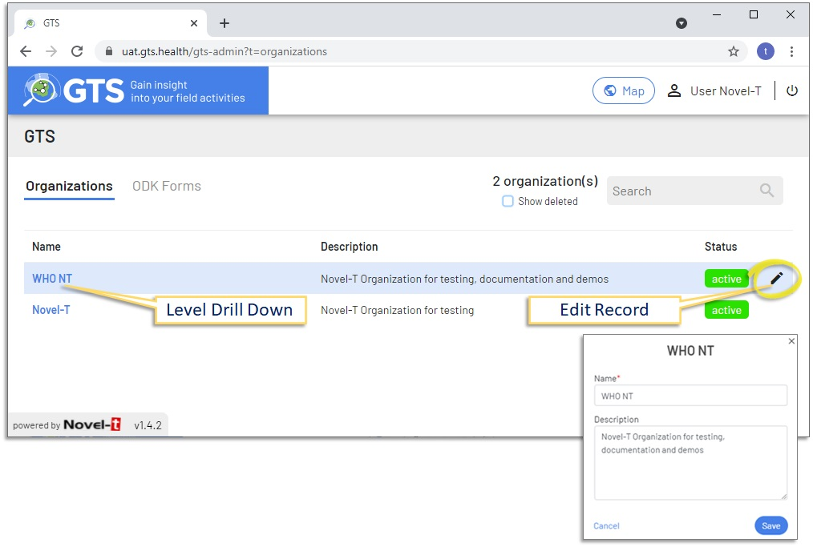
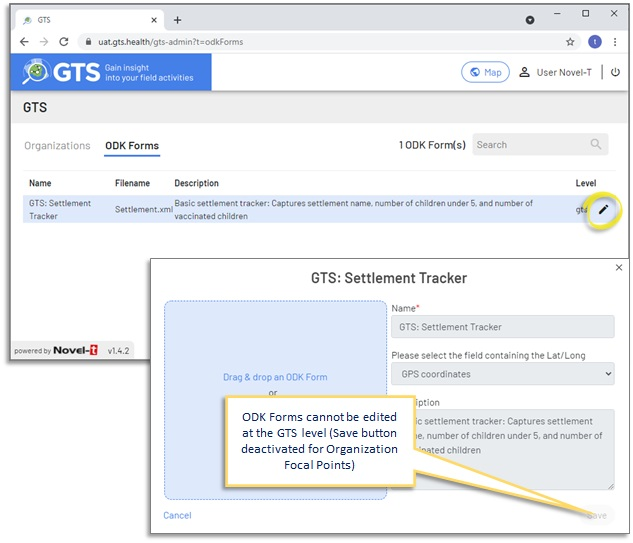

#########
GTS Level
#########
The GTS level is the highest level in the console.

.. note:: 
    This level is only displayed if the user has been granted dashboard access to more than one organization, otherwise 
    the administration console opens directly at the Organizational level.

Organizations that have been removed from the dashboard are not deleted from the database but rather hidden from view in the 
console. To view previously deleted organizations to which you had a dashboard account, Select the "show deleted" checkbox in
the upper right of the screen

    GTS Dashboard GTS Level

-------------------------------

The GTS level offers two tabs "Organizations" and "ODK Forms":

********************
1. Organizations Tab
********************
From the organization tab, it is possible to edit only the Name and Description of the organization by clicking on the pencil icon
to the right. Creation and deletion of organizations can only be performed by to the GTS System Administrator.

    GTS Dashboard Organizations Tab

-------------------------------

**********
2. ODK Tab
**********
From the ODK tab, it is possible to view ODK forms that will be available to all organizations in GTS. Focal points cannot edit
ODK Forms at the GTS level.

    GTS Dashboard Admin site navigation

-------------------------------

Click on the Organization's name to drill down to the Organization level
