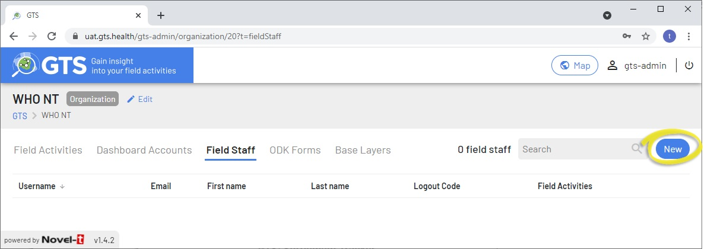

##################
Organization Level
##################

The Organization level permits editing of details and configuration for the Organization. Only an Organization Focal Point can 
edit organisation details.

The GTS level offers five tabs "Field Activities", "Dashboard Accounts", "Field Staff", "ODK Forms" and "Base Layers":

***********************
1. Field Activities Tab
***********************

From the Field Activities tab, it is possible to create and edit the activities that are to be tracked by the GTS. Field activities
are primarily defined by the interval at which tracks are collected as well as the time of day and speed of travel that determine
the validity of a tracking point.

To create a new field activity, navigate to the field activities tab at the organizational level and click on the "New" button. This 
will open a four page wizard that guides the creation of new field activities:

    GTS Dashboard New Field Activity Wizard

* The first form of the wizard receives the new activities main information:
  
  * Code: A short unique code to describe the activity 
  * Name: Full name of the activity
  * Description *optional* (all items marked with a red asterisk in wizard forms are required, otherwise they are optional)
  
* The second form concerns security on mobile devices tracking the activity:
  
  * Team Code: Team codes are short free text descriptions entered by field staff in the mobile app when tracking starts. They may be omitted, prompted for, or required. Team codes are useful in situations where many field staff use the same generic login yet need to be distinguished.
  * Code to stop tracking: An optional 4 digit code may be assigned to stop tracking, this may prevent field staff from inadvertently stopping tracking of a field activity. Leave this entry blank if no stopping code is required.

* The third form in the wizard collects tracking settings:

  * Interval: The time between the collection of tracking coordinates in seconds, by default every two minutes (120 seconds)
  * Allow upload while tracking: The GTS mobile application can deliver real time tracking providing Internet connectivity exists, use this feature with caution as it may result in excessive mobile data charges.
  * Working Hours: The time during which tracks are collected may be set. Outside of this timing no tracks are collected, this serves both to save AAndroid battery charge and to respect field staff privacy when not performing activities.

* The fourth form in the wizard concerns accountability:

  * Speed: Optional limits at which speeds tracks are considered valid can be set. This may be useful in situations where field staff travel through one targeted area to get to another and don't wish to record the first as visited.

-------------------------------

  To edit an existing field activity, hover over the field activity line with your mouse cursor and click on the edit (pencil) icon 
  to the right of the activity entry to open the form on which to edit field activity settings. Caution should be taken when editing
  field activities during a campaign as this may result with inconsistencies among field staff (differing tracking intervals for 
  example while Android phone await connectivity to update settings).

  .. figure:: ../_images/DB_Admin/image8.jpg
     :width: 800
     :alt: Image

     GTS Dashboard Field Activity edit form

-------------------------------

*********************
2. Dashboard Accounts
*********************

The Dashboard Accounts tab lists all users that have dashboard access for the organization. To create a new dashboard users account, 
navigate to the Dashboard Accounts tab at the organizational level and click on the "New" button. 

  GTS Dashboard Accounts tab

-------------------------------

Dashboard accounts may either be imported from field staff, from another organization or they may be 
created if they do not exist in the GTS environment.

Importing Dashboard Accounts
============================

  Follow these steps to import a dashboard user, after pressing the "New" button on the Dashboard Accounts tab:

  +------------------------------------------+--------------------------------------+
  | | **1)** Wait for the wizard to load     |  |DBA_Load|                          |
  | | Field Staff and Dashboard Accounts.    |                                      |
  | |                                        |                                      |
  | | By default the wizard will load all    |                                      |
  | | accounts to ensure uniqueness and      |                                      |
  | | facilitate account import.             |                                      |
  +------------------------------------------+--------------------------------------+
  | | **2)** Enter the Username or Email     | | |DBA_Search1|                      |
  | | where indicated.                       | | |DBA_Search2|                      |
  | |                                        |                                      |
  | | The drop down list will display        |                                      |
  | | Available filtered accounts, complete  |                                      |
  | | typing or select an account from the   |                                      |
  | | List.                                  |                                      |
  | |                                        |                                      |
  | |                                        |                                      |
  | |                                        |                                      |
  | |                                        |                                      |
  | |                                        |                                      |
  | |                                        |                                      |
  | |                                        |                                      |
  | |                                        |                                      |
  | |                                        |                                      |
  | |                                        |                                      |
  | | The values for Username, Email         |                                      |
  | | Last name and First name will be       |                                      |
  | | Entered automatically to align         |                                      |
  | | with the original account entry.       |                                      |
  +------------------------------------------+--------------------------------------+
  | | **3)** Select the Role(s) to grant to  |  |DBA_Roles|                         |
  | | the user for the organization (The     |                                      |
  | | roles granted to dashboard users may   |                                      |
  | | vary from one organization to another. |                                      |
  | | (See the :ref:`Roles <Rls>` section.)  |                                      |
  | |                                        |                                      |
  | | Click on the "Import" button to finish.|                                      |
  +------------------------------------------+--------------------------------------+
  | .. Warning::                                                                    |
  |     | If a dashboard account already exists within another organization, to     |
  |     | which you have not been granted access, you will not be able to create    |
  |     | nor import the account with the same name or email address.               |
  +------------------------------------------+--------------------------------------+

-------------------------------

Creating Dashboard Accounts
===========================

Follow these steps to create a dashboard account that is new to the GTS, after pressing the "New" button on 
the Dashboard Accounts tab:

  GTS Dashboard Accounts tab

  +------------------------------------------+--------------------------------------+
  | | **1)** Click on the link *"Click here* |                                      |
  | | *if you want to create a new Dashboard*| |DBA_Load|                           |
  | | *Account"* to jump to step 3)          |                                      |
  | |                                        |                                      |
  | |                 or                     |                                      |
  | |                                        |                                      |
  | | Wait for the wizard to complete        |                                      |
  | | loading Available Accounts.            |                                      |
  +------------------------------------------+--------------------------------------+
  | | **2)** Enter the Username or Email     | |DBA_Search3|                        |
  | | into the search by box, there should   |                                      |
  | | be no matching entries. If a matching  |                                      |
  | | the account will need to be imported.  |                                      |
  | |                                        |                                      |
  | | Click on *"Could not find*             |                                      |
  | | *corresponding Dashboard Account?"*    |                                      |
  | |                                        |                                      |
  +------------------------------------------+--------------------------------------+
  | | **3)** Enter optional values for Email,|  |DBA_Identity|                      |
  | | last name and first name.              |                                      |
  | |                                        |                                      |
  | | If a GMail address is entered the      |                                      |
  | | option to connect with a GTS Password  |                                      |
  | | will appear (see                       |                                      |
  |  :ref:`Authentication <Ath>` below)      |                                      |
  +------------------------------------------+--------------------------------------+
  | | **4)** Select the Role(s) to grant to  |  |DBA_Roles2|                        |
  | | the user for the organization.         |                                      |
  | | (See the :ref:`Roles <Rls>` section.)  |                                      |
  | |                                        |                                      |
  | | Click on the "Create" button to finish.|                                      |
  +------------------------------------------+--------------------------------------+

-------------------------------

Editing Dashboard Accounts
==========================

To edit existing dashboard accounts after they have been created or imported click on the edit (pencil) icon that appears to the 
right when hovering over the account entry.

  GTS Dashboard Accounts edit form

The Email address, last name, first name and roles attributed to the dashboard account may be edited, the username cannot be changed 
once an account has been created

.. _Ath:

Dashboard User Authentication
=============================

    GTS Dashboard user may authenticate logins by two methods; connecting with GTS or Google authentication. Connecting with
    GTS employs a typical Username/Password combination that is stored on the GTS server. Connecting with google authentication
    permits users to connect using their Google credentials foregoing the need to remember GTS usernames and passwords.

    .. figure:: ../_images/DB_Admin/image17.jpg
        :width: 400
        :alt: Image
  
        GTS Login Screen Authentication Choices

-------------------------------

.. _Rls:

Dashboard User Roles
====================

    GTS Dashboard users may be assigned to one or a combination of five roles avaiable:

    .. csv-table:: Dashboard User Roles
      :header: Role,Access,Description
      :widths: 10, 30, 30
 
      Member, No access , Cannot access the dashboard
      Organizationl Focal Point, Access to all features for the organization , Acts as system administrator for the organization
      Field Activity Focal Point, Access to Field ACtivities as well as Base Layers and Targeted Areas , Can manage but not create Field ACtivities
      Data Analyst, Can view maps and download data , Access only to Maps Section of the Dashboard
      Logistics Support, Field Staff instructions also batch deployments and the Tracking Data Extractor, Prepares and delivers mobile Android hardware

-------------------------------

**************
3. Field Staff
**************

The Field Staff tab lists all users that may be assigned mobile application access for the organization. Field Staff may be nominative 
or generic and a user may have both a Dashboard Account and Field Staff access simultaneously. To create a new field staff account, 
navigate to the Field Staff tab at the organizational level and click on the "New" button. 

    GTS Dashboard Admin Field Staff tab

-------------------------------

Field staff accounts may either be imported from dashboard accounts, from another organization or they may be created if they do 
not exist in the GTS environment.

Importing Field Staff Accounts
==============================

  Follow these steps to import field staff, after pressing the "New" button on the Field Staff tab:

  +------------------------------------------+--------------------------------------+
  | | **1)** Wait for the wizard to load     |  |FS_Load|                           |
  | | Field Staff and Dashboard Accounts.    |                                      |
  | |                                        |                                      |
  | | By default the wizard will load all    |                                      |
  | | accounts to ensure uniqueness and      |                                      |
  | | facilitate account import.             |                                      |
  +------------------------------------------+--------------------------------------+
  | | **2)** Enter the Username or Email     | | |FS_Search1|                       |
  | | where indicated.                       | | |FS_Search2|                       |
  | |                                        |                                      |
  | | The drop down list will display        |                                      |
  | | Available filtered accounts, complete  |                                      |
  | | typing or select an account from the   |                                      |
  | | List.                                  |                                      |
  | |                                        |                                      |
  | |                                        |                                      |
  | |                                        |                                      |
  | |                                        |                                      |
  | |                                        |                                      |
  | |                                        |                                      |
  | |                                        |                                      |
  | |                                        |                                      |
  | |                                        |                                      |
  | |                                        |                                      |
  | | The values for Username, Email         |                                      |
  | | Last name and First name will be       |                                      |
  | | Entered automatically to align         |                                      |
  | | with the original account entry.       |                                      |
  +------------------------------------------+--------------------------------------+
  | | **3)** Enter an optional logout code   | |FS_Logout|                          |
  | | if required.                           |                                      |
  | |                                        |                                      |
  | | The logout code prevents field staff   |                                      |
  | | from inadvertently logging out from    |                                      |
  | | the mobile application, stopping the   |                                      |
  | | collection of tracks                   |                                      |
  | |                                        |                                      |
  | |                                        |                                      |
  +------------------------------------------+--------------------------------------+
  | | **4)** Select the Role(s) to grant to  |  |FS_Roles|                          |
  | | the user.                              |                                      |
  | |                                        |                                      |
  | | (See the :ref:`Roles <Rls>` section.)  |                                      |
  | |                                        |                                      |
  | |                                        |                                      |
  +------------------------------------------+--------------------------------------+
  | .. Danger::                                                                     |
  |     | If importing a dashboard account, avoid changing the roles as they        |
  |     | will affect the user's overall access. Roles assigned on this form        |
  |     | will **NOT** be specific to the field staff activities.                   |
  +------------------------------------------+--------------------------------------+
  | | **5)** Select the Field Activities     | |FS_FAs|                             |
  | | that the field staff user will have    |                                      |
  | | access to.                             |                                      |
  | |                                        |                                      |
  | | Click "Import" to complete the         |                                      |
  | | operation.                             |                                      |
  +------------------------------------------+--------------------------------------+

-------------------------------

Creating Field Staff
====================

  To create field staff new to the GTS, follow these steps after pressing the "New" button on 
  the Field Staff tab:

  +------------------------------------------+--------------------------------------+
  | | **1)** Click on the link *"Click here* |  |FS_Load|                           |
  | | *if you want to create a new Field*    |                                      |
  | | *Staff"* to jump to step 3)            |                                      |
  | |                                        |                                      |
  | |                 or                     |                                      |
  | |                                        |                                      |
  | | Wait for the wizard to complete        |                                      |
  | | loading Available Accounts.            |                                      |
  +------------------------------------------+--------------------------------------+
  | | **2)** Enter the Username or Email     | |FS_Search3|                         |
  | | into the search by box, there should   |                                      |
  | | be no matching entries. If a matching  |                                      |
  | | the account will need to be imported.  |                                      |
  | |                                        |                                      |
  | | Click on *"Could not find*             |                                      |
  | | *corresponding Field Staff"*           |                                      |
  | |                                        |                                      |
  +------------------------------------------+--------------------------------------+
  | | **3)** Select "Yes" or "No" to the     |  |FS_Type|                           |
  | | Question if you Know the field staff   |                                      |
  | | individually                           |                                      |
  | |                                        |                                      |
  | | **Yes** => Nominative Field Staff      |                                      |
  | |                                        |                                      |
  | | **No** => Generic Field Staff          |                                      |
  | |                                        |                                      |
  +------------------------------------------+--------------------------------------+
  | | **4)** Enter an optional logout code   | |FS_Logout|                          |
  | | if required.                           |                                      |
  | |                                        |                                      |
  | | The logout code prevents field staff   |                                      |
  | | from inadvertently logging out from    |                                      |
  | | the mobile application, stopping the   |                                      |
  | | collection of tracks                   |                                      |
  | |                                        |                                      |
  | |                                        |                                      |
  +------------------------------------------+--------------------------------------+
  | | **5)** Select the Role(s) to grant to  |  |FS_Roles2|                         |
  | | the user.                              |                                      |
  | |                                        |                                      |
  | | This option only appears for           |                                      |
  | | nominative accounts (selecting "Yes"   |                                      |
  | | in step 3 above).                      |                                      |
  | |                                        |                                      |
  | | If the Field Staff user will not be    |                                      |
  | | using the dashboard, they typically    |                                      |
  | | will only need the "Member" role.      |                                      |
  | |                                        |                                      |
  | | (See the :ref:`Roles <Rls>` section.)  |                                      |  
  +------------------------------------------+--------------------------------------+
  | | **6)** Select the Field Activities     | |FS_FAs|                             |
  | | that the field staff user will have    |                                      |
  | | access to.                             |                                      |
  | |                                        |                                      |
  | | Click "Import" to complete the         |                                      |
  | | operation.                             |                                      |
  +------------------------------------------+--------------------------------------+

.. |FS_Roles2| image:: ../_images/DB_Admin/image27.jpg

Editing Field Staff
===================

To edit existing field staff after they have been created or imported click on the edit (pencil) icon that appears to the 
right when hovering over the account entry.

  GTS Field Staff edit form

The following values appear on the edit field staff form

.. csv-table:: Edit Field Staff Form Fields
  :header: Value,Description
  :widths: 10, 30

  Username, Cannot be changed once user is created
  Email, Email addresses can be changed (Google authentication persists if an account with a Google email address as name receives a new email address)
  Password, The Field Staff password can be changed (**POSSIBLE SECURITY HOLE**)
  Last Name, The user's sir name can be edited
  First Name, The user's given name can be edited
  Nominative, The account type (Nominative or Generic) may be changed  
  Field Activities, Field activities may be assigned or withdrawn
  Logout Code, A logout code may be added or removed
  Roles, Roles for the user may be changes (use this feature with caution on imported accounts)

************
1. ODK Forms
************
ODK forms may be associated with field activities, field staff will be able to use forms to capture contextual information from the Android device while 
performing a field activity.

From the ODK tab, it is possible to view ODK forms that will be available to the organization, either at the GTS level or at the Organizational level. 
Click on the "New" button in the ODK tab at the organization level, to add an ODK form that will be available to all field activities in the organizational.

.. admonition:: To Do

    - Describe ODK forms / zipped file
    - Describe Upload process / access levels
    - Describe hoe delivered to phones (High level)

-------------------------------

**************
5. Base Layers
**************
.. admonition:: To Do

    - Describe Base Layers shape files and nesting
    - Describe geographic investigation and aggregation using TAs

